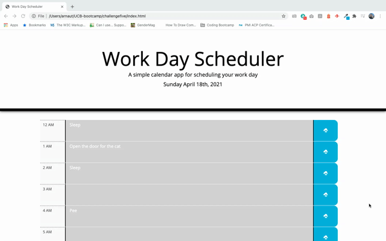
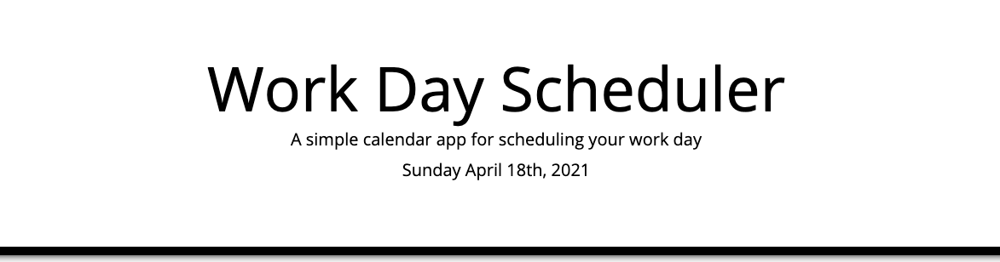

# 05 jQuery To-do List with localStorage
Simple calendar application that allows the user to save events for each hour of the day. This app runs in the browser and features dynamically updated HTML and CSS powered by *jQuery* and *Bootstrap*.

## See it in action

> See the live app here: https://acevezl.github.io/challengefive/



## Table of Contents
* [Initial Setup](#Initial-setup)
* [Displaying the time blocks](#Displaying-the-time-blocks)
* [Saving tasks](#Saving-tasks)

### Initial setup

In terms of script, I'm creating these two variables to hold the current date, and a JSON object with all events that may have been previously saved in the past.
```
var currentDate = moment();

// Retrieve events from local storage
var events = JSON.parse(localStorage.getItem('today-events')) || [];
```

### Displaying the time blocks

In order to display the full day in hour-by-hour time blocks, I've created the following function:

```
// Paint the full day of time blocks (each time block is 1hr)
function paintDay() {
    // logic will be here
}
```
The first step is to show the current date on the _current-date_element on the top of the screen. I'm using Moment.js to format the _currentDate_ variable in a human-friendly way.

```
// Paint the full day of time blocks (each time block is 1hr)
function paintDay() {
    
    var currentDayEl = $('#current-date')[0];
    currentDayEl.innerText = moment(currentDate).format("dddd MMMM Do, YYYY");
    ...
```
The rendered header will now look like this:

Now we want to select the day block element, which will contain all the time blocks (hours) for our users to enter their calendar events. Since jQuery pulls an array of objects, and we only have one object, we can simply do the following to pick up the one and only *#day-block* element:
```
    ...
    var dayBlock = $('#day-block')[0];
    ...
```
I'm using a *for* cycle to paint 24 time blocks (one per hour of the day) in the screen. Starting at 0hrs and finishing at 23hrs.

Inside the *for* loop, I'm creating four elements:
* A &lt;div&gt; element to wrap the time-block elements: hour, description, and save button.
* A &lt;div&gt; element to display the hour
* A &lt;textarea&gt; element to allow users to enter the event description and save it
* A &lt;button&gt; element for users to click and save to localStorage

You'll notice I'm appending the hour div, task textarea, and save button into the _timeBlock_ which in turn is a child of _dayBlock_ - the main container we selected earlier.

```
    ...
    for (i=0; i<24; i++) {
        
        // Create a time block
        var timeBlock = $('<div>').appendTo(dayBlock);
        timeBlock.addClass('row');
        timeBlock.addClass('time-block');
        
        // Create a div for the hour
        var hourEl = $('<div>').appendTo(timeBlock);
        hourEl.addClass('col-1');
        hourEl.addClass('hour');
        hourEl[0].innerHTML = moment({hour: i}).format("h A");

        // Create a div for the task textarea
        var taskEl = $('<textarea>');
        taskEl.addClass('col-10');
        taskEl.addClass('description');
        taskEl.attr('id', 'event-'+i);
        taskEl[0].innerText = '';

        timeBlock.append (taskEl);

        // Create a div for the save button
        var saveBtn = $('<button>').appendTo(timeBlock);
        saveBtn.addClass('col-1 saveBtn oi oi-cloud-upload');
        saveBtn.attr('block-hr-id',i);
        saveBtn.click(saveCalendarEvent);
        
    }

```
> **Note:** You may have noticed I'm appending elements in two different ways - this is on purpose, I wanted to try both of these ways:
>``` 
> // Way # 1 to append to another HTML element (my preferred method)
> var hourEl = $('<div>').appendTo(timeBlock);
>
> // Way # 2 to append to another HTML element
> var taskEl = $('<textarea>');
> ...
> timeBlock.append (taskEl);
>```

When the tasks have occurred in the past, they need to be colored gray, and when they are in the future, they must be green. The task that is occurring right now needs to be colored red.

To accomplish this, well use three CSS classes:

```
.past {
  background-color: #d3d3d3;
  color: white;
}

.present {
  background-color: #ff6961;
  color: white;
}

.future {
  background-color: #77dd77;
  color: white;
}
```
These classes are assigned with the following code, which is included within the *for* loop. We simply compare the current time with the hour we're painting in the screen and, depending on the result we assign the appropriate styles. 
> If the current time is after the hour we're paining, the event we're drawing is in the past. If the current hour is equal to the hour of the event we're paining on the screen, it is in the present. And finally, if the current time is before the event we're paining, the event occurs in the future.
```
...
// Update classes to indicate past, present, and future events
if (moment(currentDate).format("H") > i) {
    taskEl.addClass('past');
} else {
    if (moment(currentDate).format("h A") === moment({hour: i}).format("h A")) {
        taskEl.addClass('present');
    } else {
        taskEl.addClass('future');
    }
}
...
```

### Saving tasks
While we paint the time blocks in the screen, I'm also creating an array of objects that will hold each event data. The very first time that it runs, the array will contain 24 empty objects, but as the users enter data and save it, the array will also contain data. To accomplish this part, I'm adding the following code to the *for* loop that prints the full day:
```
// Populate the events array (even if time slots are empty)
if (events[i]) {
    taskEl[0].innerText = events[i].description;
} else {
    // Create event object
    var eventObject = {
        time: parseInt(i),
        description: ''
    }
    events.push(eventObject);
}
```

Then, as you may have noticed on my code above, when I create the save button, I'm also assigning an event listener:

```
    // Create a div for the save button
    var saveBtn = $('<button>').appendTo(timeBlock);
    saveBtn.addClass('col-1 saveBtn oi oi-cloud-upload');
    saveBtn.attr('block-hr-id',i);
    saveBtn.click(saveCalendarEvent); // This makes the magic happen
```
> **Note:** Just as easily we could add the same event listener to the &lt;textarea&gt; blur event, this will allow users to save the event as soon as they finish typing and move on to another element.

The actual function to save the event is very simple: We get the hour and description, update our events array, and stringify the object into *localStorage*.

```
function saveCalendarEvent(event){
    
    // Get hour of the event [0-23]
    var eventHour = this.getAttribute('block-hr-id');
    var eventDescription = $('#event-'+eventHour).val();

    // Store to local storage
    events[eventHour].time = parseInt(eventHour);
    events[eventHour].description = eventDescription ;
    localStorage.setItem('today-events', JSON.stringify(events));

}
```
Et voilà - Now we just need to ensure we call the *paintDay()* function to start the calendar.
```
paintDay();
```